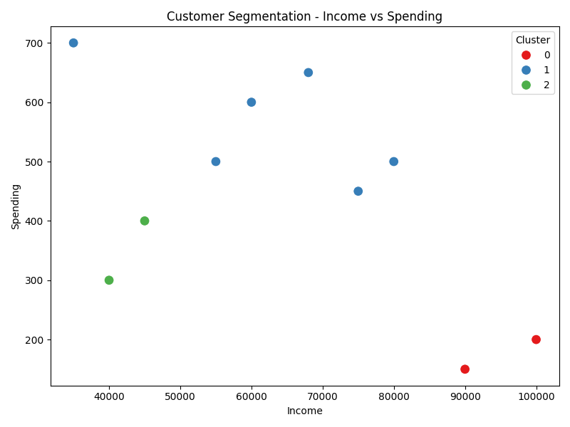

# 👥 Project 3: Customer Segmentation using K-Means Clustering

## 🎯 Objective
To identify distinct customer groups based on their behavior using K-Means clustering.

## 🛠️ Tools Used
- Python
- pandas, seaborn, matplotlib
- scikit-learn

## 📁 Dataset
- Features: Age, Income, Frequency, Spending
- Records: 10 sample customers

## 🧠 Method
1. Load and scale the data
2. Apply K-Means clustering (k=3)
3. Visualize clusters on a 2D scatter plot

## 📊 Output

## 📄 Result
The customers were grouped into 3 clusters based on similarity in income and spending.

## 👩‍💻 Author
Suparna Chaudhari 
